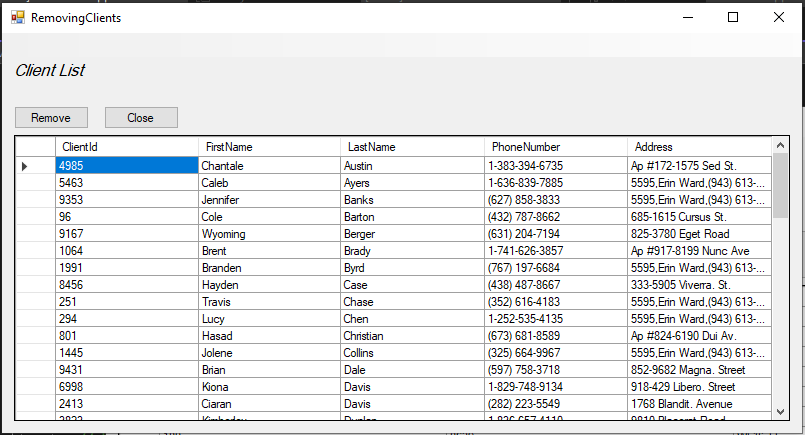
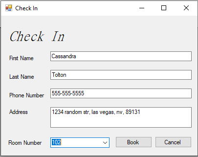
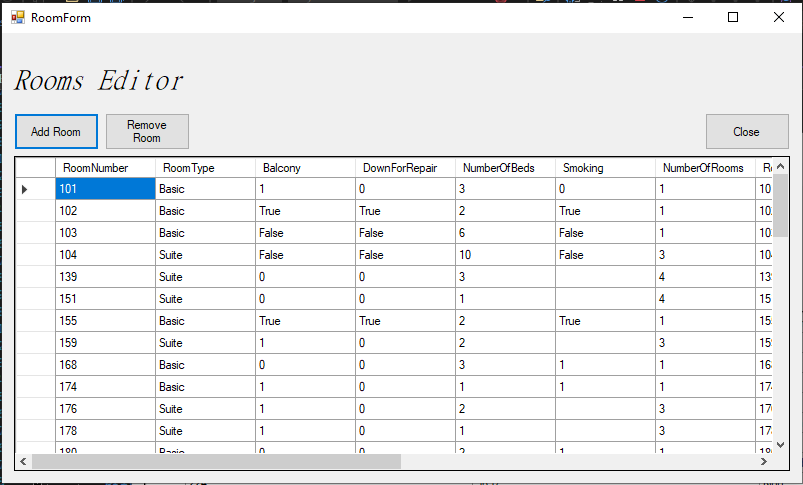

# Hotel Booking Application
**Languages:** C#, Dapper, SQL

## Description
A backend application that takes data from a sql server consisting of three tables. Clients, Rooms and Occupancies, all stored within the application as classes and uses a grid view to display the data. Can change the data from within the application ranging from adding, deleting and editing the data.

### Issues
several issues that need to be fixed:
  1. if you close the clients or room windows without using the close button it will stay open in the background, and if you try to open it again the app will crash  
     Fix: either auto close it before you open it again, or add and onclick event to the x and close it that way.
  2. when trying to remove clients, it will crash as its not converting the id from string to int.
    fix: rewrite the code so that it will properly convert and delete the client.
    
### Main Window

*the main screen that can show the rooms available, rooms booked, rooms down for repair and the clients.*

### Check In window

*check in window that asks for customers information to make a booking*

### Client List

*shows the list of clients that are staying or have previously stayed at the hotel. information displayed includes: ID, First name, Last name, Phone number and address*
### Room Editor

*room editor shows all rooms, and displays all inforation/type of room it is. like if it has a balcony, can smoke in and if its a suite.*
